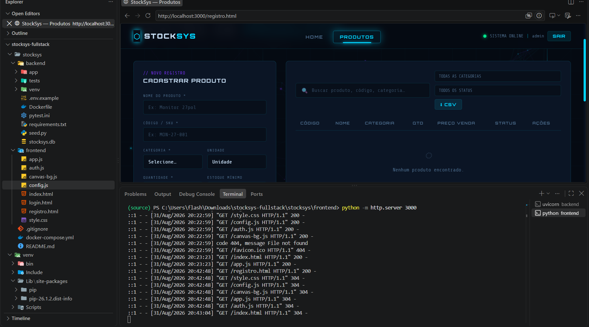
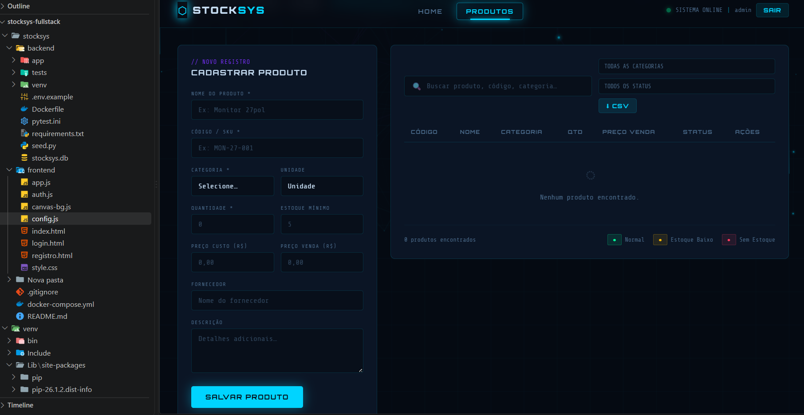

# StockSys — Sistema de Gestão de Estoque (Full-Stack)

> Sistema de controle de estoque com frontend HTML/CSS/JS e uma API REST em Python (FastAPI), com autenticação JWT e persistência em banco de dados.


---

## Visão Geral

O StockSys evoluiu de um protótipo 100% client-side (dados em `localStorage`) para uma aplicação **full-stack** de verdade:

- **Backend**: API REST em **Python** com **FastAPI**, banco de dados via **SQLAlchemy** (SQLite por padrão, trocável para PostgreSQL), autenticação **JWT**, testes automatizados com **pytest** e empacotamento em **Docker**.
- **Frontend**: a mesma interface HTML/CSS/JS de antes (estética HUD/neon com Canvas 2D), agora consumindo a API via `fetch` em vez de `localStorage`.

O objetivo dessa reestruturação é sair do "projeto de estudo" e chegar perto de como um sistema real é construído: camadas separadas, validação de dados, autenticação, testes e um jeito reproduzível de rodar tudo (Docker).

---

## Screenshots





---

## Arquitetura

```
stocksys/
├── backend/                 → API REST (Python / FastAPI)
│   ├── app/
│   │   ├── main.py          → instância FastAPI, CORS, rotas
│   │   ├── database.py      → engine SQLAlchemy, sessão por requisição
│   │   ├── models.py        → modelos ORM (Product, User)
│   │   ├── schemas.py       → schemas Pydantic (validação de entrada/saída)
│   │   ├── security.py      → hashing de senha (bcrypt) + JWT
│   │   ├── deps.py          → dependência get_current_user (protege rotas)
│   │   ├── crud.py          → acesso a dados / regras de negócio
│   │   └── routers/
│   │       ├── auth.py      → POST /api/auth/register, /login
│   │       ├── products.py  → CRUD de produtos + export CSV
│   │       └── dashboard.py → KPIs e distribuição por categoria
│   ├── tests/                → testes automatizados (pytest)
│   ├── seed.py                → cria o usuário admin inicial
│   ├── requirements.txt
│   ├── Dockerfile
│   └── .env.example
│
├── frontend/                 → HTML / CSS / JS puro
│   ├── index.html            → Dashboard (KPIs, gráfico, últimos produtos)
│   ├── registro.html         → CRUD completo de produtos
│   ├── login.html            → tela de login / cadastro
│   ├── config.js             → aponta para a URL da API
│   ├── auth.js               → gerencia o token JWT e chamadas fetch
│   ├── app.js                → lógica da aplicação (agora via API)
│   ├── canvas-bg.js          → animação de fundo (Canvas 2D)
│   └── style.css             → design system
│
├── screenshots/               → imagens do sistema funcionando
├── docker-compose.yml         → sobe a API com um comando
└── README.md
```

**Fluxo de autenticação:** o usuário faz login em `login.html` → a API retorna um token JWT → o token é guardado no `localStorage` do navegador e enviado em `Authorization: Bearer <token>` em toda chamada subsequente → todas as rotas de produtos e dashboard exigem esse token.

---

## Como rodar

### 1. Backend (API)

```bash
cd backend
python -m venv venv
source venv/bin/activate      # Windows: venv\Scripts\activate
pip install -r requirements.txt

cp .env.example .env          # ajuste se necessário

python seed.py                # cria o usuário admin / admin123
uvicorn app.main:app --reload --port 8000
```

A API sobe em `http://localhost:8000`. A documentação interativa (Swagger) fica automaticamente disponível em:

- **http://localhost:8000/docs** (Swagger UI — dá pra testar todos os endpoints direto no navegador)
- **http://localhost:8000/redoc** (documentação alternativa)

### 2. Ou via Docker (um comando só)

```bash
docker compose up --build
```

### 3. Frontend

O frontend é HTML/CSS/JS puro, então basta servir a pasta `frontend/`:

```bash
cd frontend
python -m http.server 3000
```

Acesse `http://localhost:3000/login.html`. Usuário padrão: `admin` / `admin123`.

> Se a API estiver em outro host/porta, ajuste `frontend/config.js`.

### 4. Rodando os testes do backend

```bash
cd backend
pytest -v
```

---

## Endpoints da API

| Método | Rota | Descrição | Autenticado |
|---|---|---|---|
| POST | `/api/auth/register` | Cria usuário e retorna token | Não |
| POST | `/api/auth/login` | Login (OAuth2 password flow) | Não |
| GET | `/api/produtos` | Lista produtos (busca + filtros) | Sim |
| GET | `/api/produtos/{id}` | Detalhe de um produto | Sim |
| POST | `/api/produtos` | Cria produto | Sim |
| PUT | `/api/produtos/{id}` | Atualiza produto (parcial) | Sim |
| DELETE | `/api/produtos/{id}` | Remove produto | Sim |
| GET | `/api/produtos/categorias` | Lista categorias cadastradas | Sim |
| GET | `/api/produtos/export/csv` | Exporta inventário em CSV | Sim |
| GET | `/api/dashboard/stats` | KPIs gerais | Sim |
| GET | `/api/dashboard/categorias` | Distribuição por categoria | Sim |
| GET | `/api/health` | Health check | Não |

---

## Modelo de Dados (Product)

| Campo | Tipo | Obrigatório | Descrição |
|---|---|---|---|
| `id` | string | Auto | ID único (gerado no backend) |
| `nome` | string | ✅ | Nome do produto |
| `codigo` | string | ✅ | Código/SKU único |
| `categoria` | string | ✅ | Categoria do produto |
| `unidade` | string | — | un, cx, kg, l, m |
| `quantidade` | int | ✅ | Quantidade em estoque |
| `minimo` | int | — | Limite para alerta (padrão: 5) |
| `preco_custo` | float | — | Preço de custo |
| `preco_venda` | float | — | Preço de venda |
| `fornecedor` | string | — | Nome do fornecedor |
| `descricao` | string | — | Descrição adicional |
| `status` | string | Calculado | `ok` / `low` / `zero`, derivado de quantidade x mínimo |

### Regras de status

| Status | Critério |
|---|---|
| **ok** | `quantidade > mínimo` |
| **low** | `0 < quantidade ≤ mínimo` |
| **zero** | `quantidade = 0` |

---

## Decisões técnicas (e por quê)

- **FastAPI** em vez de Flask/Django: tipagem nativa com Pydantic, documentação OpenAPI gerada automaticamente, suporte assíncrono e uma curva de configuração muito menor para um projeto deste porte.
- **SQLAlchemy + SQLite por padrão**: zero fricção para rodar localmente, mas a troca para PostgreSQL é só uma variável de ambiente (`DATABASE_URL`), sem tocar em código.
- **JWT stateless**: a API não guarda sessão em memória/banco — qualquer instância pode validar o token, o que facilita escalar horizontalmente no futuro.
- **Separação schemas (Pydantic) vs modelos (SQLAlchemy)**: o que entra na API (`ProductCreate`), o que é armazenado (`Product`) e o que sai (`ProductOut`) são coisas explicitamente diferentes — evita expor campos internos por acidente.
- **Testes com banco em memória**: os testes de `pytest` rodam contra um SQLite `:memory:` isolado, então não sujam o banco de desenvolvimento e rodam rápido.

---

## Roadmap (próximos passos sugeridos)

- [ ] Migrations versionadas com Alembic (hoje as tabelas são criadas via `create_all`)
- [ ] Paginação nos endpoints de listagem
- [ ] Histórico de movimentações (entradas/saídas de estoque)
- [ ] Papéis de usuário (admin vs operador)
- [ ] CI (GitHub Actions) rodando `pytest` a cada push
- [ ] Deploy da API (Render/Railway/Fly.io) + frontend (Vercel/Netlify/GitHub Pages)
- [ ] Rate limiting nas rotas de autenticação

---

## Licença

MIT License — livre para uso, modificação e distribuição com atribuição.
